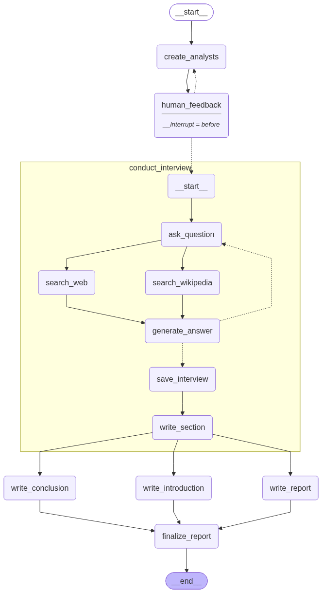

# Automated Research Synthesis

A multi-agent research and report generation system built on LangGraph. Given a topic, it spins up a panel of AI analysts, has each interview an AI expert (backed by web and Wikipedia search), and compiles the resulting sections into a structured report with human-in-the-loop feedback.

## Workflow



1. **create_analysts** – generates a set of analyst personas for the given topic.
2. **human_feedback** – pauses the graph so a human can approve or refine the analyst list.
3. **conduct_interview** – for each analyst, runs a sub-graph that asks questions, searches the web (Tavily) and Wikipedia, generates expert answers, saves the transcript, and writes a section.
4. **write_introduction / write_report / write_conclusion** – run in parallel once all interviews finish.
5. **finalize_report** – assembles introduction, body, and conclusion into the final report.

## Features

- Multi-agent interviews driven by LangGraph, with per-analyst context gathered from live web and Wikipedia search
- Human-in-the-loop checkpoint to approve or adjust analyst personas before interviews run
- Pluggable LLM backend (Anthropic, OpenAI, Google Gemini, Groq) via a config-driven model loader
- Report export to DOCX and PDF, saved under `generated_report/`
- FastAPI web app with login/signup and a dashboard to submit topics, give feedback, and download reports
- Structured logging and custom exception handling throughout the pipeline

## Project Structure

```
research_and_analyst/
  api/            FastAPI app, routes, services, templates
  config/         LLM and retriever configuration (configuration.yaml)
  database/       SQLAlchemy models and DB setup
  exception/      Custom exception classes
  logger/         Structured logging setup
  prompt_lib/     Prompt templates used by the workflows
  schemas/        Pydantic/TypedDict state and data models
  utils/          Config loader, model loader
  workflows/      LangGraph workflow builders (interview, report generator)
static/           CSS/JS for the web UI
generated_report/ Output reports (DOCX/PDF), one folder per run
```

## Setup

Requires Python 3.14+.

```
uv sync
```

or, using pip:

```
pip install -r requirements.txt
```

Create a `.env` file in the project root with your API keys:

```
GROQ_API_KEY=...
ANTHROPIC_API_KEY=...
GOOGLE_API_KEY=...
OPENAI_API_KEY=...
TAVILY_API_KEY=...
```

Model selection and parameters are configured in `research_and_analyst/config/configuration.yaml`.

## Usage

Run the FastAPI web app:

```
uvicorn research_and_analyst.api.main:app --reload
```

Then open the app in your browser to sign up, log in, and submit a research topic from the dashboard.

Run the report generation workflow directly from the command line:

```
python research_and_analyst/workflows/report_generator_workflow.py
```

## Screenshots

| Login | Dashboard | Generating |
|---|---|---|
|  |  |  |

| Feedback | Final report |
|---|---|
|  |  |

<details>
<summary>Server log for the run above</summary>

```
uvicorn research_and_analyst.api.main:app --reload
INFO:     Uvicorn running on http://127.0.0.1:8000
INFO:     Application startup complete.
INFO:     127.0.0.1:61587 - "POST /login HTTP/1.1" 302 Found
INFO:     127.0.0.1:61587 - "GET /dashboard HTTP/1.1" 200 OK

{"event": "LLM loaded successfully", "provider": "anthropic", "model": "claude-sonnet-4-5-20250929"}
{"event": "Report generation graph built successfully", "module": "AutonomousReportGenerator"}
{"event": "Starting report pipeline", "topic": "Network Intrusion Detection using Machine Learning"}
{"event": "Analysts created", "count": 3}
INFO:     127.0.0.1:58576 - "POST /generate_report HTTP/1.1" 200 OK

{"event": "Feedback updated", "module": "ReportService"}
{"event": "Generating analyst question"}  x3   # Dr. Sarah Chen, Marcus Rodriguez, Dr. Aisha Okonkwo
{"event": "Performing Tavily web search"}  x3
{"event": "Generating expert answer"}      x3
{"event": "Report section generated successfully"}  x3
{"event": "Writing report"}
{"event": "Introduction generated", "length": 2051}
{"event": "Conclusion generated", "length": 1509}
{"event": "Report finalized"}
{"event": "Report saved successfully", "format": "docx", "path": "generated_report/.../Network_Intrusion_Detection_using_Machine_Learning_20260820_155105.docx"}
{"event": "Report saved successfully", "format": "pdf",  "path": "generated_report/.../Network_Intrusion_Detection_using_Machine_Learning_20260820_155105.pdf"}
INFO:     127.0.0.1:53822 - "POST /submit_feedback HTTP/1.1" 200 OK
INFO:     127.0.0.1:57880 - "GET /download/Network_Intrusion_Detection_using_Machine_Learning_20260820_155105.pdf HTTP/1.1" 200 OK
```

</details>

## Tech Stack

LangGraph, LangChain, FastAPI, SQLAlchemy, Tavily Search, Wikipedia, python-docx, ReportLab